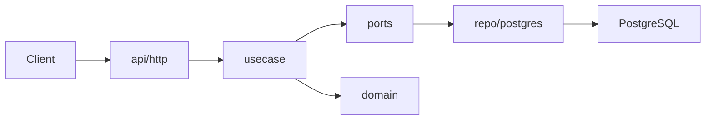
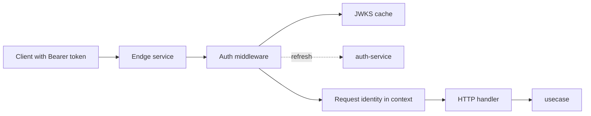
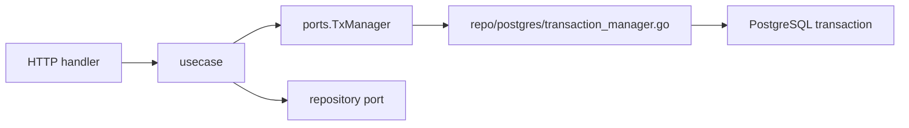
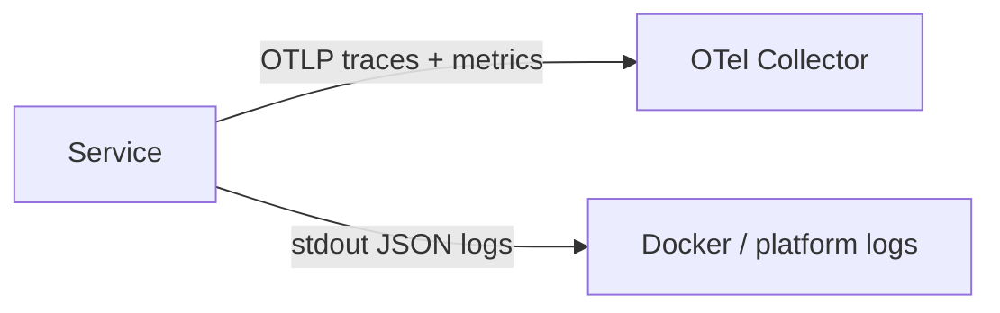
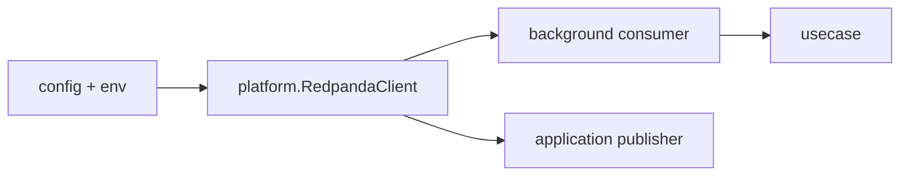

# Endge Service Template Architecture

Этот файл описывает production-стандарт нового Endge-сервиса поверх шаблона.

## 1. Роль сервиса

Каждый сервис из шаблона предполагается как отдельный business-service:

- со своей PostgreSQL-базой
- со своим HTTP API
- со своим доменом
- с общей auth-моделью через `auth-service`
- с общей telemetry-моделью через `otel-collector`

## 2. Слои



Правила:

- `domain` не знает про HTTP, Postgres и middleware
- `usecase` владеет orchestration и transaction boundary
- `usecase/ports` описывает, что application layer хочет от внешнего мира
- `repo/postgres` реализует эти контракты

HTTP-код разделен по области действия:

- `api/http` содержит composition root, middleware, unversioned endpoints и общий error responder
- `api/http/v1` содержит только resource-specific adapters версионированного API
- request/response DTO и HTTP mapping живут рядом с handler своего ресурса

### 2.1. Именование application layer

В `internal/usecase/<resource>` конкретная application-точка ресурса называется
`UseCase`, а её конструктор — `NewUseCase`:

```go
package queries

type UseCase struct {
    lifecycle  *documents.Lifecycle
    repository ports.QueryRepository
}

func NewUseCase(
    lifecycle *documents.Lifecycle,
    repository ports.QueryRepository,
) *UseCase
```

Методы `Create`, `Patch`, `Delete`, `Restore` и другие представляют отдельные
пользовательские сценарии, сгруппированные в application entry point своего
ресурса. Для MVP они не разделяются на отдельные структуры без самостоятельной
оркестрации и зависимостей.

HTTP adapter объявляет собственный минимальный input-port с именем `UseCase` и
принимает concrete application use case через binding:

```go
package query

type UseCase interface {
    Create(context.Context, documents.CreateInput) (*entities.Document, error)
}

func BindUseCase(useCase *queries.UseCase) UseCase {
    return useCase
}
```

Одинаковое имя не создаёт конфликта, потому что типы принадлежат разным Go
packages: `query.UseCase` является transport-owned интерфейсом, а
`queries.UseCase` — concrete application implementation.

Общие механизмы, которые сами не являются пользовательскими сценариями, не
называются `UseCase` или абстрактным `Service`. Для них используется имя по
ответственности:

- `documents.Lifecycle` — общий жизненный цикл workspace-документов;
- `workspace_state.Coordinator` — атомарная координация полного состояния workspace;
- `history.Recorder` — запись mutation batches и revisions;
- `Repository`, `Validator`, `Resolver` — соответствующий узкий port или механизм.

Голые `Service` и `NewService` внутри `internal/usecase` запрещены: такое имя не
отличает application use case от domain service, внешнего клиента или
инфраструктурного механизма. Термин `service` допустим для самого запускаемого
backend-сервиса и для явно названного domain/infrastructure service, но не как
универсальное имя application-структуры.

Файлы следуют той же терминологии:

```text
internal/usecase/queries/usecase.go
internal/usecase/workspaces/usecase.go
internal/usecase/documents/lifecycle.go
internal/usecase/workspace_state/coordinator.go
internal/usecase/history/recorder.go
```

Сложный resource use case разделяется по ответственности (`commands.go`,
`queries.go`, `memberships.go`, `restore.go`), а `usecase.go` содержит только
структуру, зависимости и конструктор. Маленький resource use case может целиком
оставаться в `usecase.go`; искусственное создание файла на каждый CRUD-метод не
требуется.

## 3. Домен

`internal/domain` делится на три части:

- `entities` для сущностей
- `valueobjects` для значимых значений с инвариантами
- `errors` для бизнесовых и application-level ошибок

## 4. Auth flow



Правила:

- JWT валидируется локально
- на каждый запрос не делаем remote introspection
- handler работает уже с готовой identity из context

## 5. Transaction flow



Правила:

- транзакцией владеет `usecase`
- репозиторий не открывает бизнес-транзакцию самовольно
- конкретная реализация транзакции остается инфраструктурной деталью

## 6. Ошибки

Распределение ошибок:

- transport parsing/validation errors живут на HTTP boundary
- доменные и application-level ошибки живут в `internal/domain/errors`
- неожиданные infrastructure errors логируются и маппятся в безопасный `500`

Стабильный внешний маппинг:

- `ErrInvalidInput` -> `400`
- `ErrNotFound` -> `404`
- `ErrConflict` -> `409`

## 7. Telemetry и logging



Правила:

- traces и metrics идут в `OTEL_EXPORTER_OTLP_ENDPOINT`
- логи остаются в `stdout`
- входящий `traceparent` или `baggage` должен продолжать существующий trace; если upstream-контекста нет, сервис начинает новый trace сам
- недоступность collector не должна ломать обработку запросов
- сервис не должен делать удаленный вызов на каждый лог
- reference-поток шаблона должен показывать child spans и trace-aware логи в `api/http`, `auth`, `usecase`, `services` и `repo/postgres`

## 8. RedPanda и event bus



Правила:

- Kafka-compatible runtime живет в `internal/platform`, а не внутри handler/use case;
- список брокеров, client id и таймауты задаются через `REDPANDA_*`;
- конкретные topic names задаёт сервисный конфиг, а не template;
- сервисные ingestion-потоки должны быть идемпотентны и готовы к повторной доставке сообщений.

## 9. Scalar и контракт

Authoritative HTTP-контракт задаётся Swagger-аннотациями handler-методов и
transport DTO. Команда `make docs` генерирует `docs/openapi3.yaml` и встраивает
его в binary через `internal/tools/openapiembed`. Сгенерированный YAML вручную не
редактируется. Scalar читает embedded-копию этого контракта.

Каждый public handler описывает method/path, русские summary и description,
parameters, request/response schemas, status codes и security. Примеры полей
хранятся в `example`-тегах самих transport DTO.

## 10. Тестовая стратегия

Шаблон ожидает четыре уровня проверки:

- unit tests рядом с `domain`, `services`, `usecase`
- architecture tests для package naming, layer boundaries и required skeleton
- `test/integration` для реальной БД и repo adapters
- `test/contract` для HTTP-контракта
- `test/e2e` для полного user flow

Отдельно для event-driven сервисов шаблон ожидает:

- unit tests на нормализацию входящих Kafka command payload-ов;
- integration tests на persistence/fanout слой;
- contract tests на HTTP receipts и polling;
- e2e-сценарии с ingest -> fanout -> client ack/dismiss.
